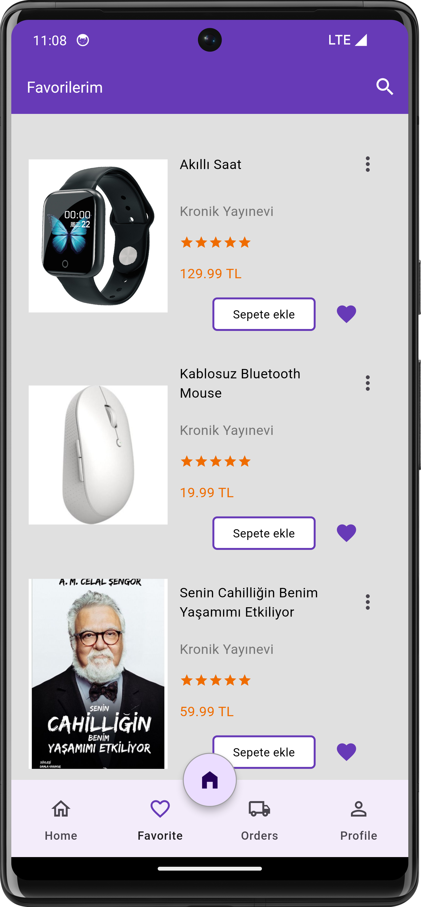

🧐 Hello, I am Bedirhan Tonğ, I am a Mobile Application developer who loves innovation.

👾 Currently, I am developing both mobile apps with Kotlin, Flutter and React Native and web apps with React.js as a hobby. I make customisable designs in line with the possibilities offered by Kotlin.

- How to reach me **bedirhantongdev@gmail.com**
- Here is my [portfolio](https://bedirhantong.vercel.app/).

  

  <ul align="center">
    
<h2 style="display: inline-block">Technologies that I know👨🏻‍💻</h2>

  </ul>

  

 

    <h2 align=center> My Featured Applications </h2>

  &nbsp;&nbsp;&nbsp;
  &nbsp;&nbsp;&nbsp;
  &nbsp;&nbsp;&nbsp;
  &nbsp;&nbsp;&nbsp;
  &nbsp;&nbsp;&nbsp;
  &nbsp;&nbsp;&nbsp;&nbsp;&nbsp;&nbsp;

<h3 align="center">
  <a href="https://github.com/bedirhantong/PersonalHealthTrackerApp">Personal Health Tracker</a> |
  <a href="https://github.com/bedirhantong/threads_clone">Threads Clone App</a> |
  <a href="https://github.com/bedirhantong/quizwiz">Quizz Wizdom</a> |
  <a href="https://github.com/bedirhantong/Dish-Dash">Store App</a> 
  <a href="https://github.com/bedirhantong/NewsApp_Compose">News App</a> 
  <a href="https://github.com/bedirhantong/health_tourism_app">Health Tourism App</a> 
  <a href="https://github.com/bedirhantong/RickMortyMovie">Rick and Morty App</a> 
</h3>
