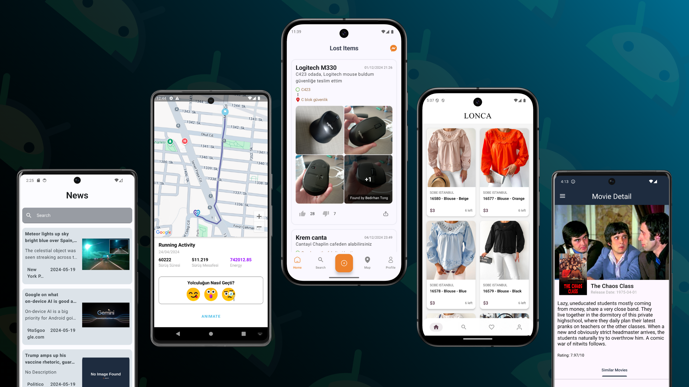

🧐 Hello, I am Bedirhan Tonğ, I am a Mobile Application developer who loves innovation.

👾 Currently, I am developing native mobile apps with Kotlin. I make customisable designs in line with the possibilities offered by Kotlin.

- How to reach me **bedirhantongdev@gmail.com**
- Here is my [portfolio](https://bedirhantongdev.vercel.app/).

  

  <ul align="center">
    
<h2 style="display: inline-block">Technologies that I am thrilled about👨🏻‍💻</h2>

  </ul>

  

