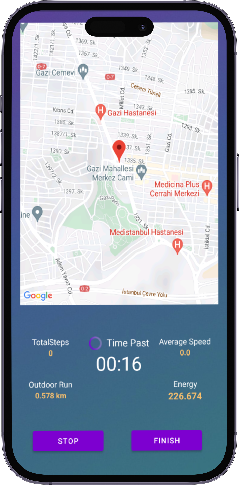
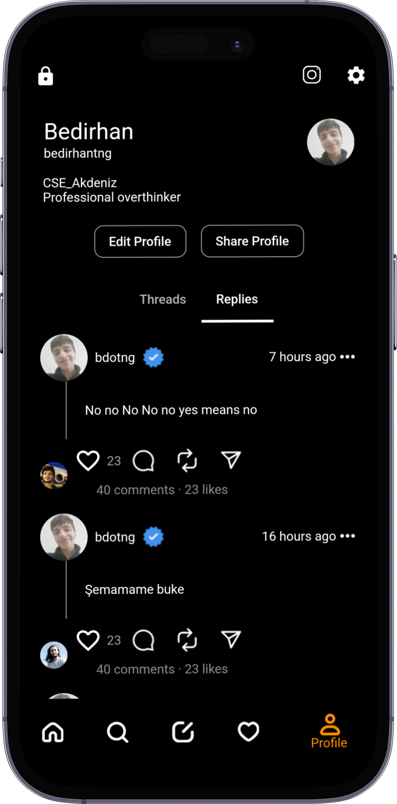
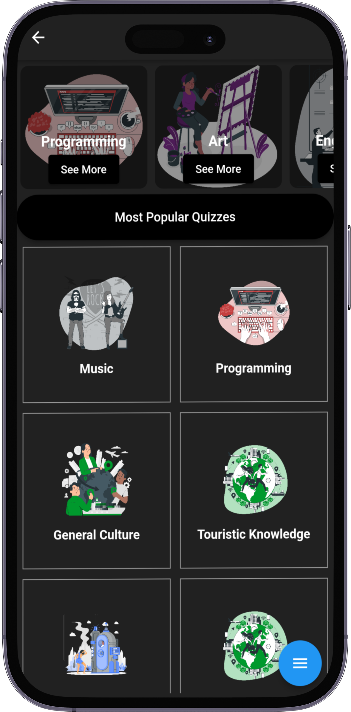
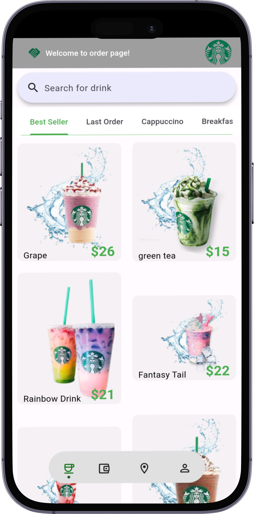

</a>

🤓I’m currently learning **Mobile application developing with Kotlin and Flutter.**.👾Also working on **open source projects**.🤝I’m looking for help with ***my public repositories*** 💪

-📫 How to reach me **bedirhantongdev@gmail.com**

  <ul align="center">
    
<h2 style="display: inline-block">Technologies that I know👨🏻‍💻</h2>

  </ul>

  

 

    <h2 align=center> My Featured Applications </h2>

  
  
  
   

<h3 align="center">
  <a href="https://github.com/bedirhantong/PersonalHealthTrackerApp">Personal Health Tracker</a> |
  <a href="https://github.com/bedirhantong/threads_clone">Threads Clone App</a> |
  <a href="https://github.com/bedirhantong/quizwiz">Quizz Wizdom</a> |
  <a href="https://github.com/bedirhantong/flutter_barista">Interactive Barista</a>
</h3>

<table align="center">
<tr border="none">
<td width="50%" align="center">
  
  
    
   

</td>

<td width="50%" align="center">

  
  
  </td>
</tr>
</table>